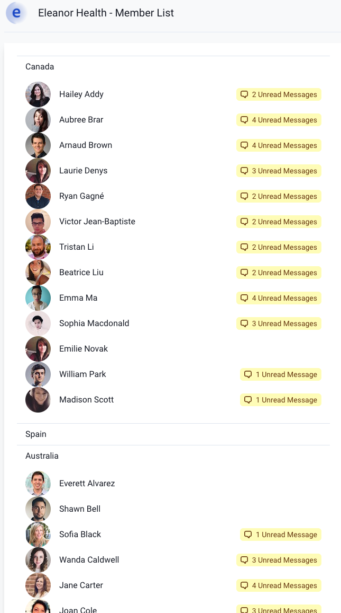

# 3) Country Grouping

## User Story

> As an Eleanor Health clinical staff person,

> When I am viewing my Member List,

> I want to see members grouped by country,

> So that I can pay attention only to countries relevant to me.

## Existing Behavior

Each member from the API has an associated country (use location: country rather than nat).

## Feature Requirements

Group members by country in a collapsible panel. They need not be sorted.
It's not required, but the Chakra [Accordion](https://chakra-ui.com/docs/disclosure/accordion) could be useful.
Organize the code as you see fit.

